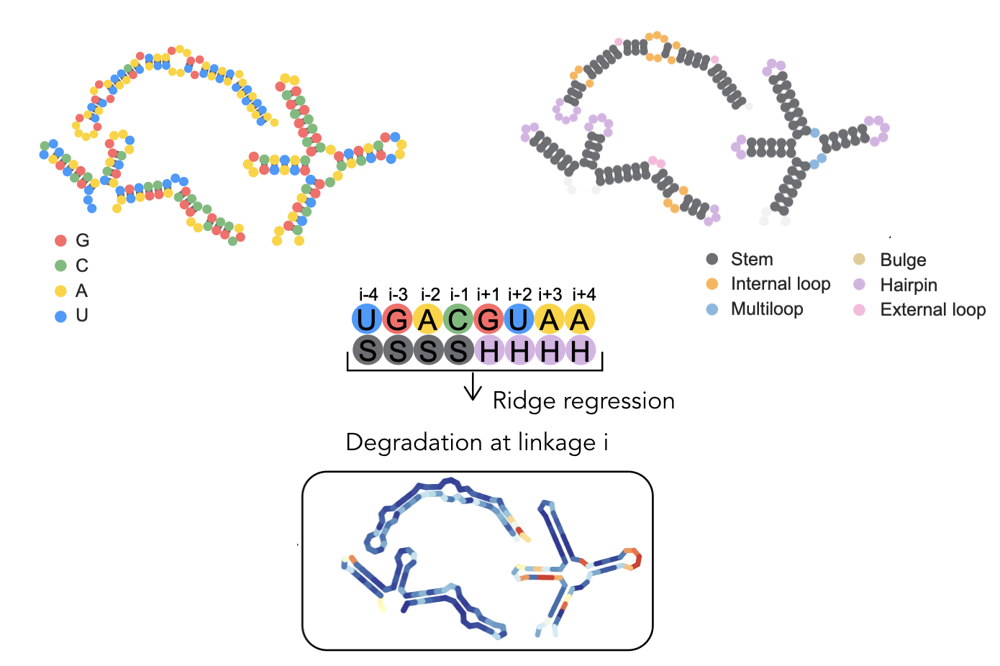

The DegScore model is a ridge regression trained on Eterna Roll-Your-Own structure data to predict RNA degradation.

Citation: Leppek, K., Byeon, G.W., Kladwang, W., Wayment-Steele, H.K., Kerr, C., ... Barna, M., Das, R. (2021). Combinatorial optimization of mRNA structure, stability, and translation for RNA-based therapeutics. https://www.biorxiv.org/content/10.1101/2021.03.29.437587v1.




Authors:

Hannah Wayment-Steele

Biruk Abreha

## Setup:

Add to python path in .bashrc, or in python code with 
```
sys.path.append('/path/to/DegScore')
```

## Usage:

Example syntax:

```
from DegScore import DegScore

mdl = DegScore('GGGUUUCCC', structure='(((...)))')
print(mdl.degscore_by_position)
print(mdl.degscore)
print(mdl.est_half_life)
```

Output:
```
[0.17  0.217 0.511 0.641 0.714 0.49  0.347 0.15  0.643]
3.8830000000000013
11.430771365678682
```

## Data Source

Raw data from In-line-seq: https://rmdb.stanford.edu/detail/RYOS1_MGPH_0000
Raw data from structure mapping: https://rmdb.stanford.edu/detail/SHAPE_RYOS_0620

Kaggle competition for degradation prediction, which used the same training/test dataset: https://www.kaggle.com/c/stanford-covid-vaccine

## To learn more

For more details on usage, and how degradation rate and half life are estimated from DegScore, see `Demo/Degscore_demo.ipynb`.

For code and data to reproduce a similar windowed Ridge regression model, see `ReproduceDegscore/reproduce_degscore.ipynb`. (Note fit is stochastic so coefficients cannot be reproduced exactly.)


## Predicting secondary structure from DegScore class

If a secondary structure is not provided and [Arnie](https://github.com/DasLab/arnie/) is set up, DegScore can also calculate a secondary structure in place.

The default package is set to EternaFold, to be the same as the Eterna DegScore 2.1 calculation. This requires having successfully set up Arnie with EternaFold.

To change to other Arnie settings:

To use ViennaRNA (if set up):
```
mdl = DegScore(sequence, package='vienna', linear=False)
```

To use LinearFold-V (if set up):
```
mdl = DegScore(sequence, package='vienna', linear=True)
